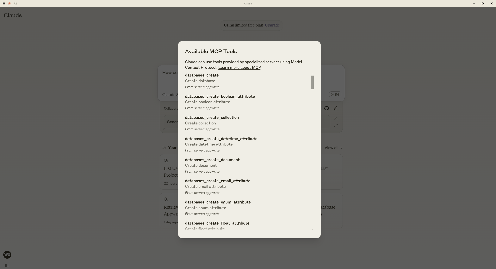
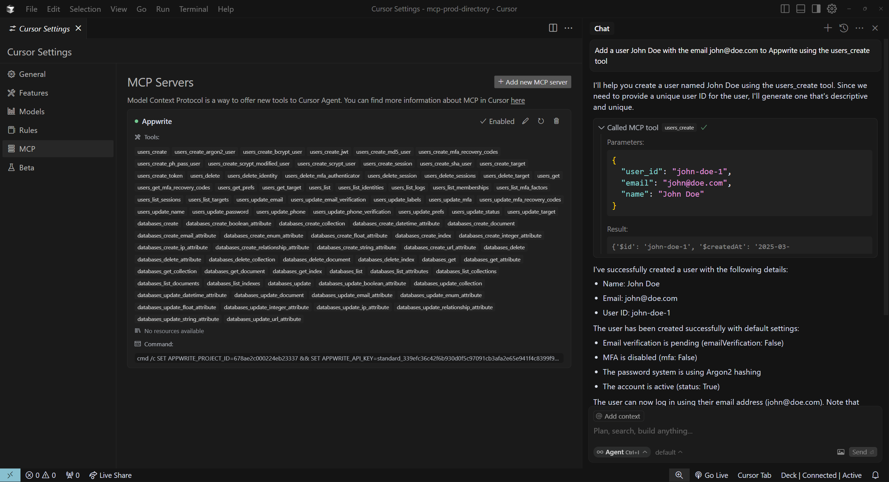
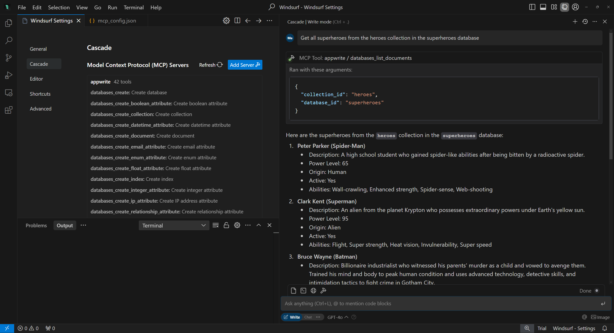
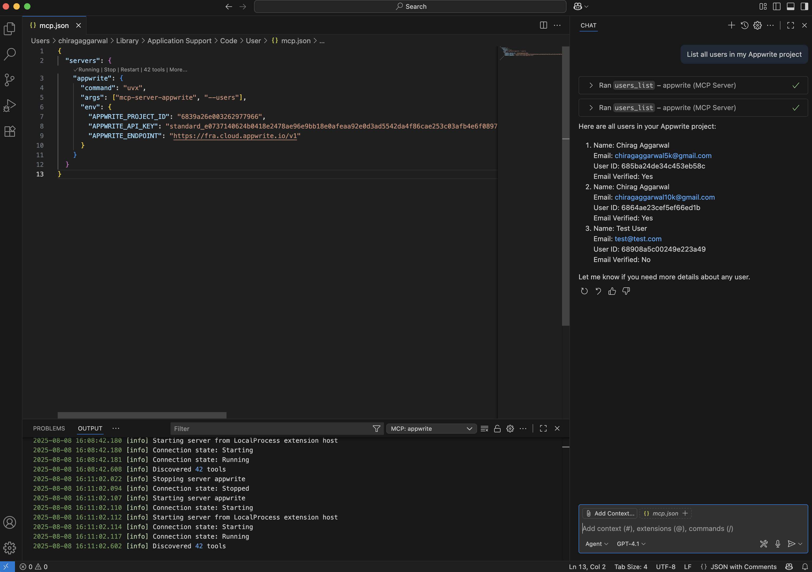

# Appwrite MCP server

mcp-name: io.github.appwrite/mcp-for-api

[](https://cursor.com/install-mcp?name=appwrite&config=%7B%22command%22%3A%22uvx%20mcp-server-appwrite%22%2C%22env%22%3A%7B%22APPWRITE_API_KEY%22%3A%22%3Cyour-api-key%3E%22%2C%22APPWRITE_PROJECT_ID%22%3A%22%3Cyour-project-id%3E%22%2C%22APPWRITE_ENDPOINT%22%3A%22https%3A//%3CREGION%3E.cloud.appwrite.io/v1%22%7D%7D)

## Overview

A Model Context Protocol server for interacting with Appwrite's API. This server provides tools to manage databases, users, functions, teams, and more within your Appwrite project.

## Quick Links
- [Configuration](#configuration)
- [Installation](#installation)
- IDE Integration:
  - [Claude Desktop](#usage-with-claude-desktop)
  - [Cursor](#usage-with-cursor)
  - [Windsurf Editor](#usage-with-windsurf-editor)
  - [VS Code](#usage-with-vs-code)
- [Local Development](#local-development)
- [Debugging](#debugging)

## Configuration

> Before launching the MCP server, you must setup an [Appwrite project](https://cloud.appwrite.io/) and create an API key with the necessary scopes enabled.

The server validates the credentials and scopes required for its built-in Appwrite service set during startup. If the endpoint, project ID, API key, or scopes are wrong, the MCP server will fail to start instead of waiting for the first tool call to fail.

Create a `.env` file in your working directory and add the following:

```env
APPWRITE_PROJECT_ID=your-project-id
APPWRITE_API_KEY=your-api-key
APPWRITE_ENDPOINT=https://<REGION>.cloud.appwrite.io/v1
```

Then, open your terminal and run the following command

### Linux and MacOS

```sh
source .env
```

### Windows

#### Command Prompt

```cmd
for /f "tokens=1,2 delims==" %A in (.env) do set %A=%B
```

#### PowerShell

```powershell
Get-Content .\.env | ForEach-Object {
  if ($_ -match '^(.*?)=(.*)$') {
    [System.Environment]::SetEnvironmentVariable($matches[1], $matches[2], "Process")
  }
}
```

## Installation

### Using uv (recommended)
When using [`uv`](https://docs.astral.sh/uv/) no specific installation is needed. We will
use [`uvx`](https://docs.astral.sh/uv/guides/tools/) to directly run *mcp-server-appwrite*.

```bash
uvx mcp-server-appwrite
```

### Using pip

```bash
pip install mcp-server-appwrite
```
Then run the server using 

```bash
python -m mcp_server_appwrite
```

### Tool surface

The server no longer accepts service-selection or mode flags. It always starts in a compact workflow so the MCP client only sees a small operator-style surface while the full Appwrite catalog stays internal.

- Only 2 MCP tools are exposed to the model:
  - `appwrite_search_tools`
  - `appwrite_call_tool`
- The full Appwrite tool catalog stays internal and is searched at runtime.
- Large tool outputs are stored as MCP resources and returned as preview text plus a resource URI.
- Mutating hidden tools require `confirm_write=true`.
- The server automatically registers all supported Appwrite services except the legacy Databases API.

If you still have older MCP configs that pass flags such as `--mode` or `--users`, remove them.

## Usage with Claude Desktop

In the Claude Desktop app, open the app's **Settings** page (press `CTRL + ,` on Windows or `CMD + ,` on MacOS) and head to the **Developer** tab. Clicking on the **Edit Config** button will take you to the `claude_desktop_config.json` file, where you must add the following:

```json
{
  "mcpServers": {
    "appwrite": {
      "command": "uvx",
      "args": [
        "mcp-server-appwrite"
      ],
      "env": {
        "APPWRITE_PROJECT_ID": "<YOUR_PROJECT_ID>",
        "APPWRITE_API_KEY": "<YOUR_API_KEY>",
        "APPWRITE_ENDPOINT": "https://<REGION>.cloud.appwrite.io/v1" // Optional
      }
    }
  }
}

```

> Note: In case you see a `uvx ENOENT` error, ensure that you either add `uvx` to the `PATH` environment variable on your system or use the full path to your `uvx` installation in the config file.

Upon successful configuration, you should be able to see the server in the list of available servers in Claude Desktop.



## Usage with [Cursor](https://www.cursor.com/)

Head to Cursor `Settings > MCP` and click on **Add new MCP server**. Choose the type as `Command` and add the command below to the **Command** field.

- **MacOS**

```bash
env APPWRITE_API_KEY=your-api-key env APPWRITE_PROJECT_ID=your-project-id uvx mcp-server-appwrite
```

- **Windows**

```cmd
cmd /c SET APPWRITE_PROJECT_ID=your-project-id && SET APPWRITE_API_KEY=your-api-key && uvx mcp-server-appwrite
```



## Usage with [Windsurf Editor](https://codeium.com/windsurf)

Head to Windsurf `Settings > Cascade > Model Context Protocol (MCP) Servers` and click on **View raw config**. Update the `mcp_config.json` file to include the following:

```json
{
  "mcpServers": {
    "appwrite": {
      "command": "uvx",
      "args": [
        "mcp-server-appwrite"
      ],
      "env": {
        "APPWRITE_PROJECT_ID": "<YOUR_PROJECT_ID>",
        "APPWRITE_API_KEY": "<YOUR_API_KEY>",
        "APPWRITE_ENDPOINT": "https://<REGION>.cloud.appwrite.io/v1" // Optional
      }
    }
  }
}
```



## Usage with [VS Code](https://code.visualstudio.com/)

### Configuration

1. **Update the MCP configuration file**: Open the Command Palette (`Ctrl+Shift+P` or `Cmd+Shift+P`) and run `MCP: Open User Configuration`. It should open the `mcp.json` file in your user settings.

2. **Add the Appwrite MCP server configuration**: Add the following to the `mcp.json` file:

```json
{
  "servers": {
    "appwrite": {
      "command": "uvx",
      "args": ["mcp-server-appwrite"],
      "env": {
        "APPWRITE_PROJECT_ID": "<YOUR_PROJECT_ID>",
        "APPWRITE_API_KEY": "<YOUR_API_KEY>",
        "APPWRITE_ENDPOINT": "https://<REGION>.cloud.appwrite.io/v1"
      }
    }
  }
}
```

3. **Start the MCP server**: Open the Command Palette (`Ctrl+Shift+P` or `Cmd+Shift+P`) and run `MCP: List Servers`. In the dropdown, select `appwrite` and click on the **Start Server** button.

4. **Use in Copilot Chat**: Open Copilot Chat and switch to **Agent Mode** to access the Appwrite tools.



## Local Development

### Clone the repository

```bash
git clone https://github.com/appwrite/mcp-for-api.git
```

### Install `uv`

- Linux or MacOS

```bash
curl -LsSf https://astral.sh/uv/install.sh | sh
```

- Windows (PowerShell)

```powershell
powershell -ExecutionPolicy ByPass -c "irm https://astral.sh/uv/install.ps1 | iex"
```

### Prepare virtual environment

First, create a virtual environment.

```bash
uv venv
```

Next, activate the virtual environment.

- Linux or MacOS

```bash
source .venv/bin/activate
```

- Windows

```powershell
.venv\Scripts\activate
```

### Run the server

```bash
uv run -v --directory ./ mcp-server-appwrite
```

## Testing

### Unit tests

```bash
uv run python -m unittest discover -s tests/unit -v
```

### Live integration tests

These tests create and delete real Appwrite resources against a real Appwrite project. They run automatically when valid Appwrite credentials are available in the environment or `.env`.

```bash
uv run --extra integration python -m unittest discover -s tests/integration -v
```

## Debugging

You can use the MCP inspector to debug the server. 

```bash
npx @modelcontextprotocol/inspector \
  uv \
  --directory . \
  run mcp-server-appwrite
```

Make sure your `.env` file is properly configured before running the inspector. You can then access the inspector at `http://localhost:5173`.

## License

This MCP server is licensed under the MIT License. This means you are free to use, modify, and distribute the software, subject to the terms and conditions of the MIT License. For more details, please see the LICENSE file in the project repository.
